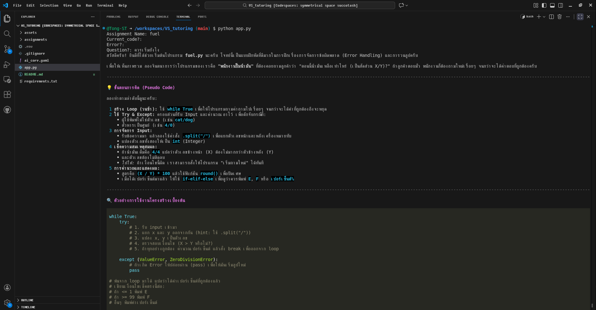

# VS Tutoring - The AI dedicated to help student learn how to code

Nowaday, Student have an easy access to all awesome AI agent that very smart and can complete their assignment within few minute without understanding.

So, In this project i will try to build AI-agent that can help them learn to code with guide, hints, give example But Not straight solution.

## Demo

## How it work?
1. Teacher upload each assignemt detail into system database.
2. AI Agent connect to database get infomation for each assignment to see what learning topic about, what contrainst, difficulty level, etc.
3. If student struggle with an assignment their can ask AI-Agent for help its will guide student without give straight solution.
4. It will also help student check their code refer to assignemnt whether it correct or not.
5. After student complete assignment it will generate learn recap of those topics.

## Development Stage
[/] Testing prompt generation with LLM.

[ ] Build AI into VScode extension.

[ ] Build Web Application for teacher to manage assignments.

[ ] Connect VScode extension with web-app via API. 

[ ] Testing MVP and create Docs.

## To test AI
I use gemini In this project: 
- To run use `python app.py`
- Requirements `google-genai` and `dotenv` for API KEY
- See an official [Google AI API doc](https://ai.google.dev/gemini-api/docs/quickstart)
- In your .env file ADD `GEMINI_API_KEY="YOUR_GEMINI_API_KEY"`